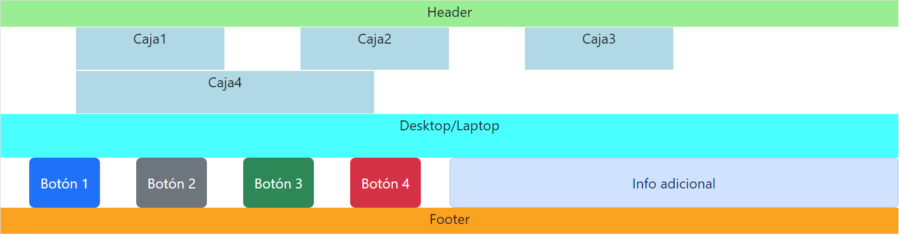
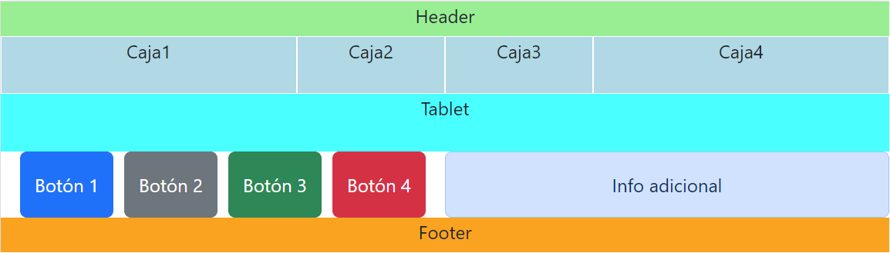
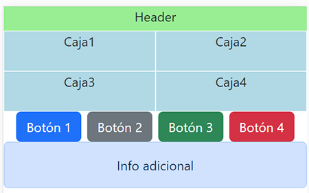

# Práctica 5.1 Ejercicio grid en Bootstrap

Crea un diseño en **Bootstrap** con al menos 12 componentes y 5 filas (pueden ser imágenes, o cuadros de texto) con las siguientes características:

-   Deberá de tener una cabecera y un footer a tamaño completo (excepto en el tamaño extra-small)
-   Deberá de tener 4 cajas que se ajusten a diferentes tamaños con diversos efectos y proporciones al variar el tamaño.
-   Deberá de mostrar un cuadro informativo indicando el tamaño mostrado en ese momento (excepto para el tamaño *extra-small*)
-   Deberá mostrar otra línea con botones u otros componentes de tu elección.
-   Deberá ajustarse al menos a tres tamaños distintos.

Deberá de mostrar un aspecto similar al mostrado al de las siguientes capturas:

-   Para *lg* o *xl* (Desktop/laptop)

    

-   Para *md* (Tablet)

    

-   Para *sm* (Smartphone)

    
